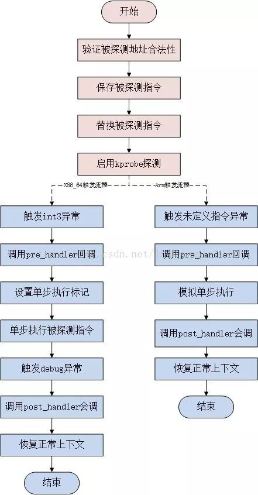
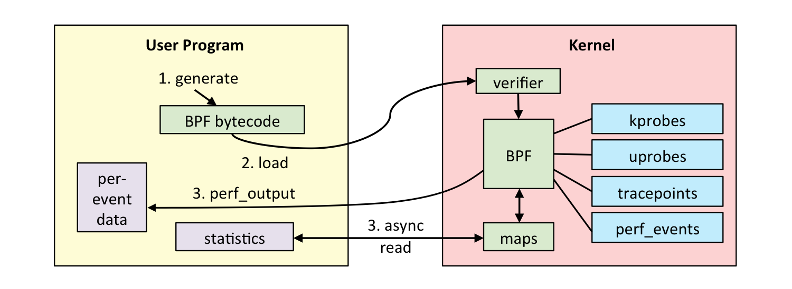

# eBPF运行时移植

>项目名称：DragonOS内核eBPF runtime实现
>
>项目主导师：Chiichen<chikejian@dragonos.org>
>
>申请人： 陈林峰
>
>日期：2024.6.3
>
>邮箱：chenlinfeng25@outlook.com

## 项目背景

### 项目描述

DragonOS是使用Rust作为主要编程语言实现的操作系统内核项目，实现内核观测工具，提高内核可观测性，是操作系统的重要研究课题之一。eBPF 则是现代Linux操作系统中一项先进且高效的内核观测工具，它用于在运行时安全有效地扩展内核的功能，而无需更改内核源代码或加载内核模块。本题目将结合现有开源实现(主要为eBPF程序到eBPF字节码的编译器)，为DragonOS实现eBPF功能，主要任务即为DragonOS实现/移植eBPF运行时，并实现相关系统调用。


### 项目要求

1. 实现eBPF功能所需的基本的内核追踪机制(例如，eBPF支持多种挂载点，可以任选一种进行实现)
2. 实现eBPF的基础功能，能够加载eBPF程序进入内核执行，并从用户空间读出数据。
3. 基于上述实现的eBPF功能，实现一个基本的内核监测程序，例如监测系统调用，I/O等等


### eBPF

eBPF 是一项革命性的技术，起源于 Linux 内核，它可以在特权上下文中（如操作系统内核）运行沙盒程序。它用于安全有效地扩展内核的功能，而无需通过更改内核源代码或加载内核模块的方式来实现。

从历史上看，由于内核具有监督和控制整个系统的特权，操作系统一直是实现可观测性、安全性和网络功能的理想场所。同时，由于操作系统内核的核心地位和对稳定性和安全性的高要求，操作系统内核很难快速迭代发展。因此在传统意义上，与在操作系统本身之外实现的功能相比，操作系统级别的创新速度要慢一些。

eBPF 从根本上改变了这个方式。通过允许在操作系统中运行沙盒程序的方式，应用程序开发人员可以运行 eBPF 程序，以便在运行时向操作系统添加额外的功能。然后在 JIT 编译器和验证引擎的帮助下，操作系统确保它像本地编译的程序一样具备安全性和执行效率。这引发了一股基于 eBPF 的项目热潮，它们涵盖了广泛的用例，包括下一代网络实现、可观测性和安全功能等领域。

如今，eBPF 被广泛用于驱动各种用例：在现代数据中心和云原生环境中提供高性能网络和负载均衡，以低开销提取细粒度的安全可观测性数据，帮助应用程序开发人员跟踪应用程序，为性能故障排查、预防性的安全策略执行(包括应用层和容器运行时)提供洞察，等等。


## 相关技术

### 内核追踪机制

Linux 存在众多 tracing tools，比如 ftrace、perf，他们可用于内核的调试、提高内核的可观测性。这些工具的背后是内核提供的一系列探测点，这些工具可以在这些探测点注入自定义函数，在函数中实现获取想要的上下文信息并保存下来。内核提供了许多类型的探测点，这里主要讨论kprobe、uprobe、tracepoint。

#### kprobes

Linux kprobes调试技术是内核开发者们专门为了便于跟踪内核函数执行状态所设计的一种轻量级内核调试技术。利用kprobes技术，内核开发人员可以在内核的绝大多数指定函数中动态的插入探测点来收集所需的调试状态信息而基本不影响内核原有的执行流程。

kprobes技术依赖硬件架构相关的支持，主要包括CPU的异常处理和单步调试机制，前者用于让程序的执行流程陷入到用户注册的回调函数中去，而后者则用于单步执行被探测点指令。需要注意的是，在一些架构上硬件并不支持单步调试机制，这可以通过一些软件模拟的方法解决(比如riscv)

在x86架构上，典型的kprobe流程如下图所示:




kprobe的工作原理如下：

1. 注册kprobe后，注册的每一个kprobe对应一个kprobe结构体，该结构中记录着探测点的位置，以及该探测点本来对应的指令。
2. 探测点的位置被替换成了一条异常的指令，这样当CPU执行到探测点位置时会陷入到异常态，在x86_64上指令是int3（如果kprobe经过优化后，指令是jmp）
3. 当执行到异常指令时，系统换检查是否是kprobe 安装的异常，如果是，就执行kprobe的pre_handler,然后利用CPU提供的单步调试（single-step）功能，设置好相应的寄存器，将下一条指令设置为插入点处本来的指令，从异常态返回；
4. 再次陷入异常态。上一步骤中设置了single-step相关的寄存器，所以原指令刚一执行，便会再次陷入异常态，此时将single-step清除，并且执行post_handler，然后从异常态安全返回.
5. 当卸载kprobe时，探测点原来的指令会被恢复回去。

kprobes技术包括3种探测手段分别为kprobe、jprobe和kretprobe，其中：

- kprobe是最基本的探测方式，是实现后两种的基础，它可以在内核的任何指令位置插入探测点；
- jprobe基于kprobe实现，只能插入到一个内核函数的入口，它用于获取被探测函数的入参值；(已被弃用)
- kretprobe也是基于kprobe实现，可以在指定的内核函数返回时才被执行。利用该方式可以获取被探测函数的返回值，还可以用于计算函数执行时间等方面。

#### uprobes

User-space probes 简称 Uprobes，它能够动态的介入应用程序的任意函数，采集调试和性能信息，且不引起混乱。目前，用户态探针有两种类型： uprobes 和 uretprobes（也叫 return 探针）。可以在应用程序的虚拟地址空间的任意指令上插入 uprobe，当用户函数返回的时候触发 uretprobe

当一个 uprobe 被注册后，Uprobes 会创建一个被探测指令的副本，停止被探测的应用程序，用断点指令替换被探测指令的首字节（在 i386 和 x86_64 上是 int3），之后让应用程序继续运行。（在插入断点的时候，Uprobes 使用与 ptrace 使用的相同的 copy on write 机制，这样断点也只影响那个进程，不会影响其他运行相同程序的进程。甚至是被探测的指令在共享库中也一样。）

当 CPU 命中断点指令的时候，发生了一个软件中断 trap，CPU 用户模式的寄存器都被保存起来，产生了一个 `SIGTRAP` 信号。Uprobes 拦截 `SIGTRAP` 信号，找到关联的 uprobe。然后，用 uprobe 结构体和先前保存的寄存器地址调用与 uprobe 关联的回调函数。这个回调函数可能会阻塞，但要记住回调函数执行期间，被探测的线程一直是停止的。

接下来，Uprobes 会单步执行被探测指令的副本，之后会恢复被探测的程序，让它在探测点之后的指令处继续执行。被单步执行的指令副本存储在每个进程的"单步跳出（SSOL）区域"中，它是由 Uprobes 在每个被探测进程的地址空间中创建的很小的 VM 区域。

如果想使用 uretprobe 探针，需要调用 `register_uretprobe()` 函数，此时 Uprobes 在函数的入口处创建一个 uprobe ，当调用被探测函数的时候命中这个探针，Uprobes 会保存 `return 地址`的一个副本，然后用"蹦床"的地址替换 `return 地址`（一段包含一个断点指令代码）。蹦床存储在 SSOL 区域中。

当被探测的函数执行它的 return 指令时，控制转移到蹦床，命中断点。Uprobes 的蹦床回调函数调用与 uretprobe 关联的回调函数，然后把已保存的指令指针设置为已保存的 return 地址，再然后就从 trap 返回后的地方恢复执行。

#### tracepoint

Tracepoint 是一个静态的 tracing 机制，开发者在内核的代码里的固定位置声明了一些 Hook 点，通过这些 hook 点实现相应的追踪代码插入，一个 Hook 点被称为一个 tracepoint.

Tracepoint由内核维护，一旦编入内核，以后基本不会变动，因此能提供稳定的ABI，而另一种内核跟踪机制kprobe则可能因为内核函数的更名或修改而在接口上发生变化。内核会尽力确保旧版本内核中的Tracepoint会继续出现在新版中。当然，由于需要人工维护，因此Tracepoint并不能覆盖所有的Linux子系统。我们可以编写基于Tracepoint的数据收集和分析工具，发挥其稳定性优势。

和其它静态插桩方式一样，Tracepoint也会和内核源码一起编译。默认情况下，Tracepoint是关闭的，因此在插桩点，Tracepoint的实际指令为`nop`，表示什么都不做。

在内核运行时，若用户使能了某一Tracepoint，Tracepoint处的`nop`指令会被动态改写为跳转指令`jmp`。`jmp`指令会跳转到当前函数的末尾，这里存放了一个数组，记录了当前Tracepoint的回调函数。用户开启Tracepoint时，探针函数也会以RCU的形式注册到这个数组中。

当Tracepoint被关闭后，跳转指令再次覆盖为`nop`，同时用户的探针函数被移除。

### bpf系统调用

一个完整的 eBPF程序通常包含用户态和内核态两部分。其中，用户态负责 eBPF程序的加载、事件绑定以及 eBPF程序运行结果的汇总输出；内核态运行在 eBPF虚拟机中，负责定制和控制系统的运行状态。



对于用户态程序来说，与内核进行交互时必须要通过系统调用来完成。而对应到 eBPF程序中，最常用到的就是 bpf 系统调用。

```c
#include <linux/bpf.h>

int bpf(int cmd, union bpf_attr *attr, unsigned int size);
```

不同版本的内核所支持的 `bpf`命令是不同的，具体支持的命令列表可以参考内核头文件 include/uapi/linux/bpf.h 中  bpf_cmd 的定义。

`bpf`系统调用的执行的操作是由cmd参数决定的. 每一个操作都有通过`attr`传递的对应参数, 这个参数是指向公用体类型`bpf_attr`的指针, `size`参数代表`attr`指针指向的数据长度。

常见的cmd如下：

`cmd`可以是下面的值

- `BPF_MAP_CREATE`: 创建一个映射, 返回一个引用此此映射的文件描述符. close-on-exec标志会自动设置
- `BPF_MAP_LOOKUP_ELEM`： 在指定的映射中根据key查找一个元素, 并返回他的值
- `BPF_MAP_UPDATE_ELEM`： 在指定映射中创建或者更新一个元素
- `BPF_MAP_DELETE_ELEM`： 在指定映射中根据key查找并删除一个元素
- `BFP_MAP_GET_NEXT_KEY`： 在指定映射中根据key查找一个元素, 并返回下一个元素的key
- `BPF_PROG_LOAD`:  验证并加载一个eBPF程序, 返回一个与此程序关联的新文件描述符

ebpf映射是一种保存不同类型数据的通用数据结构. 映射可以在不同eBPF内核程序中共享数据, 也可以在用户进程和内核之间共享数据。

内核态的eBPF程序并不能随意调用内核函数，因此，内核定义了一系列的辅助函数，用于 eBPF程序与内核其他模块进行交互。比如 bpf_trace_printk() 就是最常用的一个辅助函数，用于向调试文件系统（/sys/kernel/debug/tracing/trace_pipe）写入调试信息，用户态的eBPF程序可以从这个文件读取信息。

需要注意的是，并不是所有的辅助函数都可以在 eBPF 程序中随意使用，不同类型的 eBPF 程序所支持的辅助函数是不同的。

## 设计和实现

这一小节主要描述具体的功能模块设计和实现。

### kprobe的设计实现

eBPF可以支持多种挂载点，这里选择较为常见且易于实现的kprobe机制。在上文中已经描述了kprobe在x86架构下的主要运行过程，在实现过程中会对其进行简化。

在前期已经做过了相关的实验简单重现了kprobe的运行过程，这里简要描述其实现过程：

```rust
pub struct Kprobe {
    symbol: String, // 探测的函数名称
    symbol_addr: usize, // 探测函数的地址
    offset: usize, // 探测函数内的偏移量
    old_instruction: [u8;15], // 保存旧的指令
    old_instruction_len: usize, // 旧指令的长度
    pre_handler: Box<dyn Fn(&PtRegs)>,// 命中探测点时的回调函数
    post_handler: Box<dyn Fn(&PtRegs)>,// 执行了探测点指令后的回调函数
    fault_handler: Box<dyn Fn(&PtRegs)>,// 失败时的回调函数
}

impl Kprobe{
    pub fn install(&mut self) {
        let address = self.symbol_addr + self.offset;
        let max_instruction_size = 15; // x86_64 max instruction length
        let mut inst_tmp = [0u8; 15];
        unsafe { core::ptr::copy(address as *const u8, inst_tmp.as_mut_ptr(), max_instruction_size); }

        let decoder = yaxpeax_x86::amd64::InstDecoder::default();

        let inst = decoder.decode_slice(&inst_tmp).unwrap();
        println!("inst: {:?}", inst.to_string());
        let len = inst.len().to_const();
        println!("inst.len: {:?}", len);

        self.old_instruction = inst_tmp;
        self.old_instruction_len = len as usize;

        let ebreak_inst = 0xcc; // x86_64: 0xcc
        unsafe {
            core::ptr::write_volatile(address as *mut u8, ebreak_inst);
        }
        polyhal::pagetable::TLB::flush_vaddr(VirtAddr::new(address));
        println!(
            "Kprobe::install: address: {:#x}, func_name: {}",
            address, self.symbol
        );
    }
}

pub static BREAK_KPROBE_LIST: Mutex<BTreeMap<usize, Arc<Kprobe>>> = Mutex::new(BTreeMap::new());
pub static DEBUG_KPROBE_LIST: Mutex<BTreeMap<usize, Arc<Kprobe>>> = Mutex::new(BTreeMap::new());
fn probe_register(...){
    let mut kprobe = Kprobe::new(
        "detect_func".to_string(),
        detect_func as usize,
        0,
        pre_handler,
        post_handler,
        fault_handler,
    );

    kprobe.install();
    let kprobe = Arc::new(kprobe);
    BREAK_KPROBE_LIST.lock().insert(detect_func as usize, kprobe.clone());
    let debug_address = kprobe.debug_address();
    DEBUG_KPROBE_LIST.lock().insert(debug_address, kprobe);
}

```

- 这里使用两个map来保存了映射信息，`BREAK_KPROBE_LIST`用于在触发`break`断点指令时查找对应的kprobe，`DEBUG_KPROBE_LIST`用于在执行单步指令后查找对应的kprobe
- 在安装kprobe的过程中，需要记录被探测的原指令，由于x86是变长指令集，因此这里用了一个库来解析指令，从而得到指令的长度，并用`break`断点指令替换掉原指令

当内核执行到被探测的指令处时，会触发异常处理，在异常处理中，对断点异常做kprobe相关的判断:

```rust
pub fn ebreak_handler(trap_context:&mut TrapFrame){
    println!("<ebreak_handler>");
    let pc = trap_context.rip -1;
    let mut kporbe = BREAK_KPROBE_LIST.lock();
    let kprobe = kporbe.get_mut(&pc);
    if let Some(kprobe) = kprobe {
        kprobe.pre_handler(&trap_context);
        // set single step
        println!("set x86 single step");
        trap_context.rflags |= 0x100;
        let old_instruction = kprobe.old_inst();
        println!("old_instruction: {:x?}, address: {:#x}", old_instruction, old_instruction.as_ptr() as usize);
        // single execute old instruction
        trap_context.rip  = old_instruction.as_ptr() as usize;
        drop(kporbe);
    }else {
        println!("There is no kprobe in pc {:#x}", pc);
        panic!("skip ebreak instruction")
    }
}
```

- 首先从保存的异常上下文找到断点指令的地址，将其-1就可以得到断点指令的地址，因为断点指令只有一个字节
- 从`BREAK_KPROBE_LIST`找到对应的kprobe，调用`pre_handler`
- 设置x86处理器为单独执行模式
- 将异常上下文的rip设置为保存的旧指令所在位置，异常返回

由于开启了单步执行模式，当x86回到rip对应的位置时，执行了原来的指令后就会再次触发debug异常，再次陷入异常处理，在debug异常中，对kprobe再次判断:

```rust
pub fn debug_handler(trap_context:&mut TrapFrame){
    println!("<debug_handler>");
    let pc = trap_context.rip;
    let mut kporbe = DEBUG_KPROBE_LIST.lock();
    let kprobe = kporbe.get(&pc);
    if let Some(kprobe) = kprobe {
        kprobe.post_handler(&trap_context);
        let tf = trap_context.rflags.get_bit(8);
        println!("tf: {}", tf);
        println!("clear x86 single step");
        // clear single step
        trap_context.rflags.set_bit(8, false);
        // recover pc
        trap_context.rip = kprobe.next_address();
        drop(kporbe);
    }else {
        println!("There is no kprobe in pc {:#x}", pc);
        // trap_context.rip += 1; // skip ebreak instruction
        panic!("skip ebreak instruction")
    }
}
```

其过程与断点异常。只是这里需要把单步执行关闭，同时设置异常上下文的rip到正确的位置，而这里就用到了之前保存指令长度相关的信息。

在riscv平台上，也做了相关的尝试，不过riscv平台上没有单步调试支持，因此其实现是使用了断点异常来模拟单步执行的过程。

### 运行时移植

运行时移植主要是为内核添加一个执行bpf字节码的虚拟机。从零实现这个虚拟机工作量比较大且容易出错，这里可以采用社区已有的较好的实现。

目前社区已有的两个实现:

1. https://github.com/solana-labs/rbpf
2. https://github.com/qmonnet/rbpf

这些实现已经支持了大部分的bpf字节码,且可以运行在no_std环境下。对于简单的功能实现来说应该已经足够。


### bpf系统调用实现

在内核添加了运行时和kprobe的支持后，虽然可以运行bpf程序了，但是需要从用户态加载bpf程序并且与内核交互的话还需要实现bpf相关的系统调用支持。

上文已经给出了bpf相关的系统调用信息，在实现早期，不用将其全部实现，选择可以快速检验功能的几个参数进行实现即可。也就是上文给出的：

- `BPF_MAP_CREATE`: 创建一个映射, 返回一个引用此此映射的文件描述符. close-on-exec标志会自动设置
- `BPF_MAP_LOOKUP_ELEM`： 在指定的映射中根据key查找一个元素, 并返回他的值
- `BPF_MAP_UPDATE_ELEM`： 在指定映射中创建或者更新一个元素
- `BPF_MAP_DELETE_ELEM`： 在指定映射中根据key查找并删除一个元素
- `BFP_MAP_GET_NEXT_KEY`： 在指定映射中根据key查找一个元素, 并返回下一个元素的key
- `BPF_PROG_LOAD`:  验证并加载一个eBPF程序, 返回一个与此程序关联的新文件描述符

对于映射来说，暂时只需关注hashmap即可。

rust有现成的hashmap库可以使用，也许可以简化相关的实现。

除此之外，内核还需要实现一些bpf_helper函数。

1. 添加bpf系统调用
2. 实现部分参数的处理
3. 实现一些简单的内核帮助函数
4. 在用户态实现一个简单lib包装bpf系统调用，方便用户程序使用

### 内核监测程序

在完成上面的一系列实现后，就可以编写一个简单的检测程序检验实现的正确性。这里可以根据实现的kprobe和支持的map类型进行选择。比较简单的是编写一个统计系统调用的监测程序。


## 规划

### 项目研发第一阶段

- [x] 熟悉[DragonOS](https://github.com/DragonOS-Community/DragonOS)的源代码，并正确运行
  - [x] 实现一个用户程序，明晰程序的执行流程
- [x] 实现kprobe机制
  - [x] 增加kprobe相关的数据结构
  - [x] 增加断点异常对kprobe的处理
  - [x] 增加debug异常对kprobe的处理
  - [x] 可选地在riscv架构下实现kprobe
- [x] 移植运行时
  - [x] 将已有的运行时加入内核中
  - [x] 运行时可以执行一些简单的bpf程序

### 项目研发第二阶段

- [x] 实现bpf相关的系统调用
  - [x] 添加bpf系统调用，并处理部分参数
  - [x] 实现内核帮助函数
  - [x] 封装用户态系统调用成一个简单的lib
- [x] 实现一个简单ebpf用户程序，打通用户态和内核态的执行流程
- [x] 实现一个内核监测程序
- [x] 编写相关的文档


## 总结

希望在完成这个实现后，可以把ebpf的移植工作变成一个操作系统无关的，方便移植到各种os上。

## Reference

[bpf syscall](https://docs.kernel.org/userspace-api/eBPF/syscall.html)

[uprobes](https://www.edony.ink/deep-in-eBPF-uprobe/)

[tracepoint](https://www.iserica.com/posts/brief-intro-for-tracepoint/)

[tracepoint](https://www.infoq.cn/article/jh1lruqqti3gjvs5dh6b)

https://terenceli.github.io/%E6%8A%80%E6%9C%AF/2020/08/05/tracing-basic

https://blog.csdn.net/lidan113lidan/article/details/121801335